## Desarrollo Móvil Integral

### DMI-10B-YesNoApp 210458
**Por: Jorge Cazarez Cruz**

---

### Objetivo del Proyecto

El objetivo de este proyecto es crear una aplicación móvil en Flutter, como parte de la Unidad 2 de la asignatura de Desarrollo Móvil Integral. El propósito es aprender y comprender el uso de los **Widgets Stateless** y **Stateful** dentro del desarrollo de aplicaciones móviles.

---

## Historial de Prácticas

A continuación se presenta el historial de las prácticas realizadas:

| **No.** | **Nombre de la Práctica**               | **Potenciador** | **Estatus**  |
|---------|-----------------------------------------|-----------------|--------------|
| 21      | Integración de Widgets                 | 6               | Finalizada   |
| 22      | Implementación de la Interfaz de Usuario | 7               | Finalizada   |
| 23      | Implementación de Respuestas del Chat  | 10              | Finalizada   |

---

## Estructura del Proyecto

### Carpeta Principal

La estructura de las carpetas es la siguiente:

---

## Descripción de las Prácticas

### **Práctica 21: Integración de Widgets**

| **Captura** | **Descripción** |
|-------------|-----------------|
| 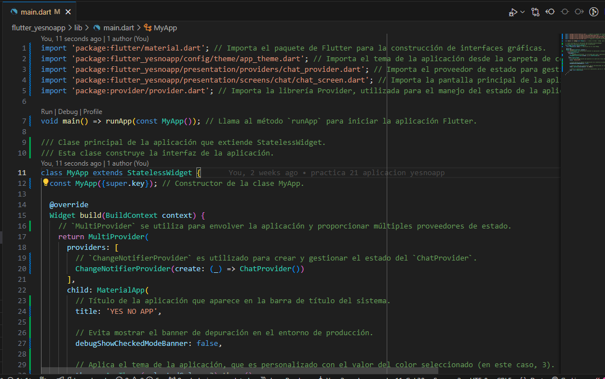 | El archivo `main.dart` sirve como punto de entrada de la aplicación. Inicializa el widget `MyApp` y configura el estado utilizando `Provider`, asegurando una gestión centralizada del estado en toda la aplicación. |
| 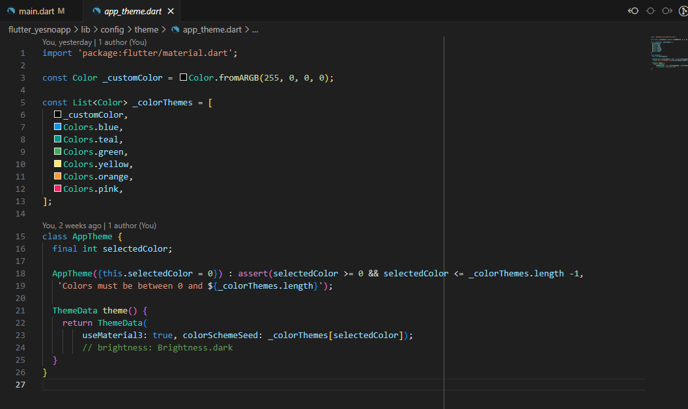 | `AppTheme` define un tema dinámico que cambia según el índice proporcionado. Este tema garantiza una experiencia de usuario coherente, utilizando Material Design 3. |
| 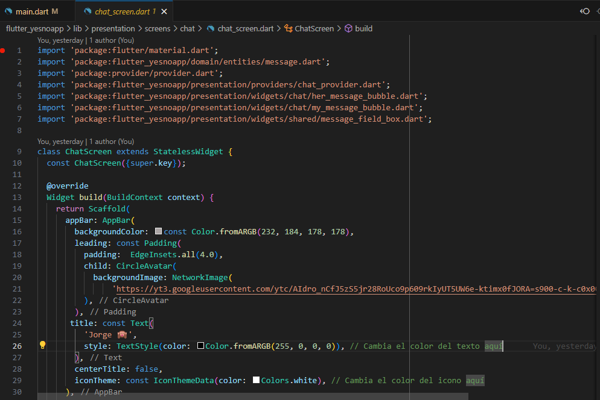 | `ChatScreen` es la pantalla principal donde se muestra el chat. Se encuentra estructurada con un avatar, un título y la vista del chat que muestra los mensajes enviados. |

---

### **Práctica 22: Implementación de la UI**

| **Captura** | **Descripción** |
|-------------|-----------------|
| 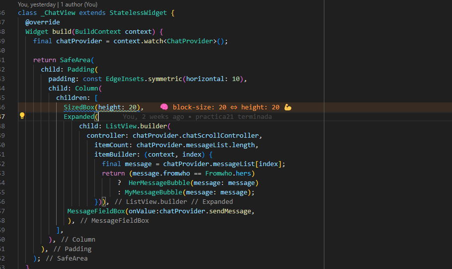 | `_ChatView` es el widget que muestra los mensajes en un `ListView.builder`. Cada mensaje se presenta en burbujas, diferenciadas por el remitente. Además, incluye un campo de texto para escribir nuevos mensajes. |
| 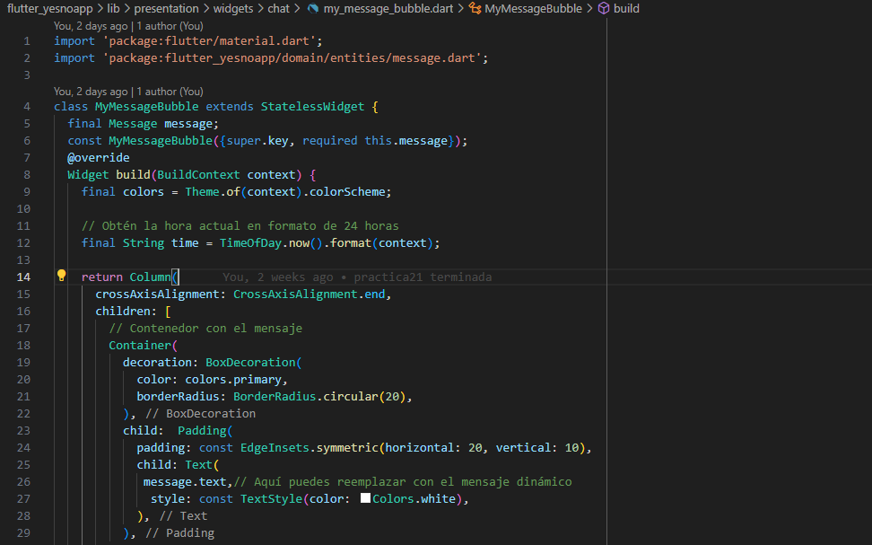 | `MyMessageBubble` estiliza los mensajes enviados por el usuario. Utiliza el color primario del tema como fondo y texto blanco para garantizar la visibilidad. |
| 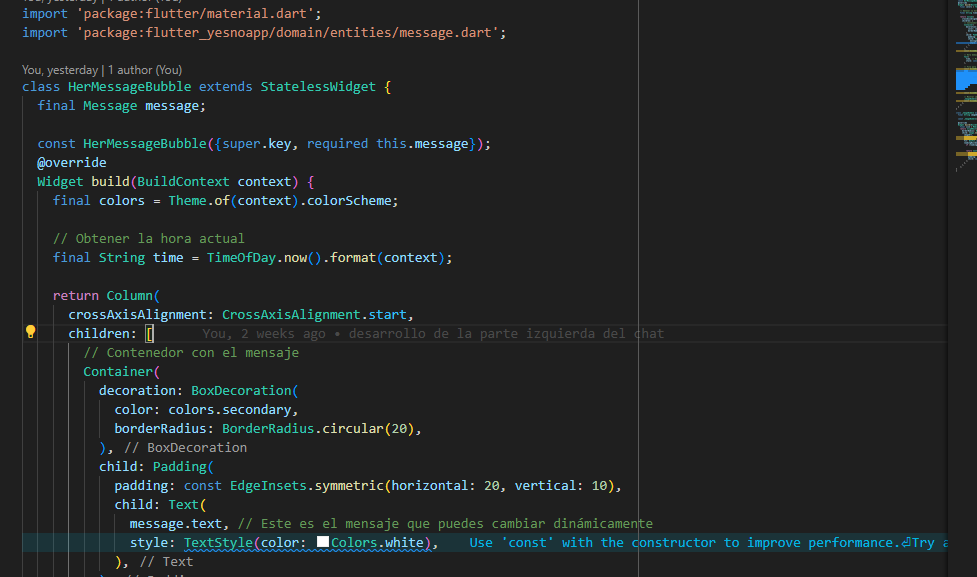 | `OtherMessageBubble` muestra los mensajes de otros usuarios con un diseño limpio, utilizando un color secundario de fondo y márgenes adecuados para separar los mensajes. |
| 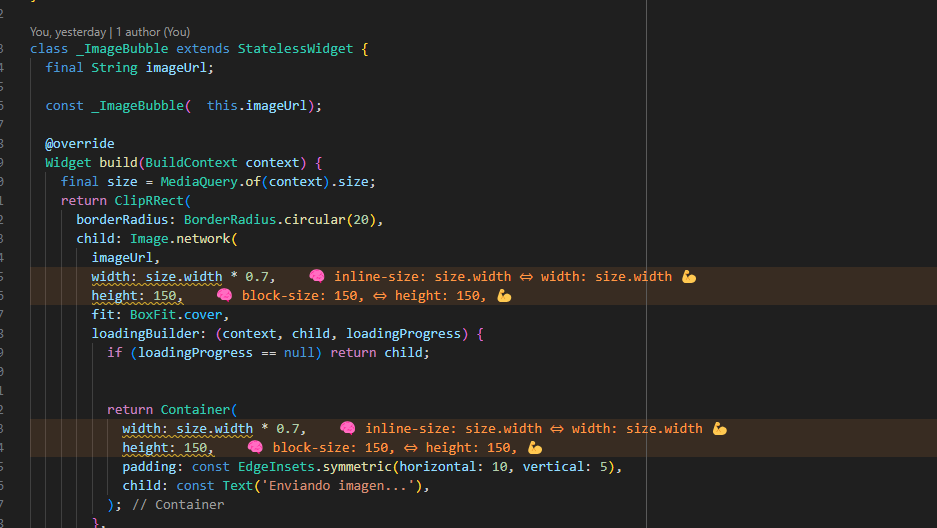 | `ImageBubble` presenta imágenes dentro del chat, con bordes redondeados y un diseño responsive. Además, incluye un indicador de carga mientras la imagen se está cargando. |
| 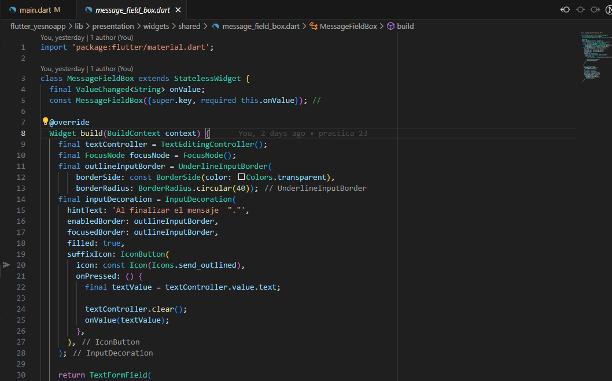 | `MessageFieldBox` es el campo de texto donde los usuarios escriben sus mensajes. Cuenta con un botón estilizado para el envío y maneja el enfoque de manera eficiente para mejorar la experiencia de uso. |

---

### **Práctica 23: Implementación de Respuestas del Chat**

| **Captura** | **Descripción** |
|-------------|-----------------|
| 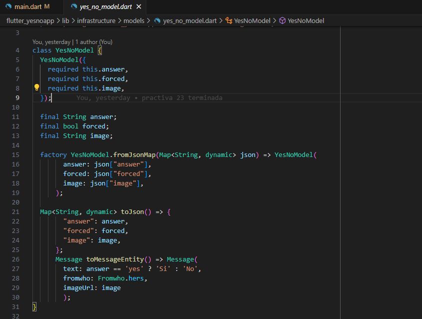 | `YesNoModel` es un modelo que maneja las respuestas de tipo "sí" o "no". Este modelo transforma las respuestas en formato JSON y las convierte en un objeto que puede ser utilizado dentro del flujo del chat. |
| 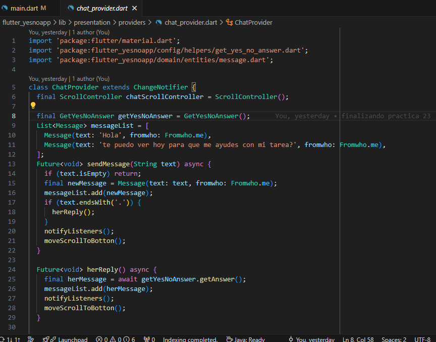 | `ChatProvider` gestiona el estado del chat, incluyendo el envío de mensajes y la respuesta automática. También es responsable de la actualización en tiempo real de la interfaz de usuario. |
| 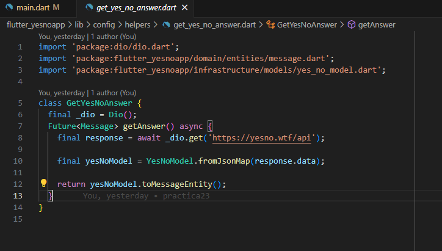 | `GetYesNoAnswer` conecta con la API `yesno.wtf` para obtener respuestas de tipo "sí" o "no". Luego las transforma en objetos internos que se integran al flujo del chat. |
| 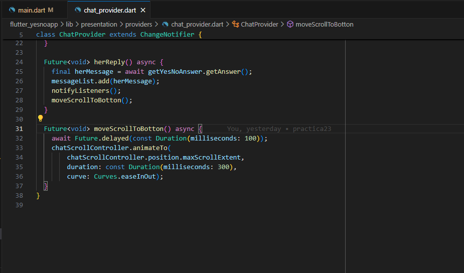 | El método `moveScrollToBottom` permite que los mensajes más recientes sean visibles, desplazando automáticamente la vista al final del chat. Esto asegura que los usuarios siempre vean los mensajes más nuevos. |

---

## Resultados

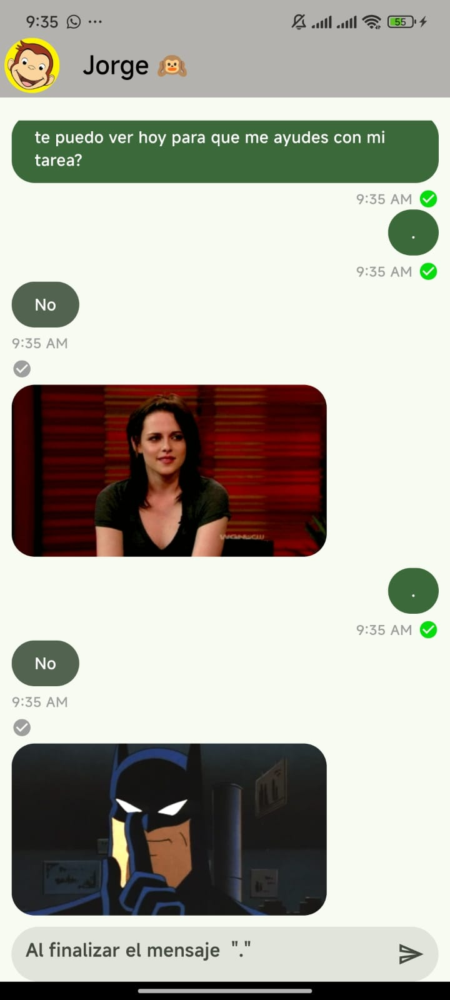

---

### Agradecimientos

Gracias por tu tiempo y por revisar el proyecto. ¡Nos vemos en la siguiente práctica!
